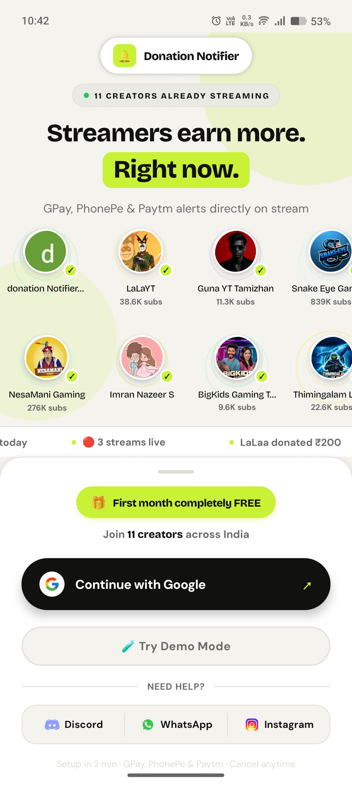
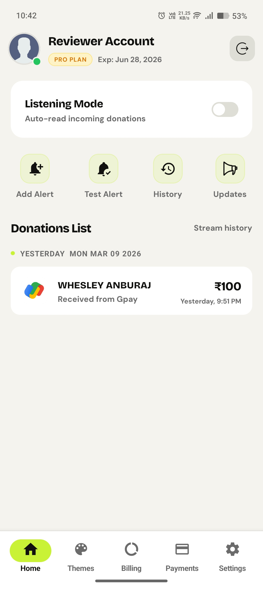
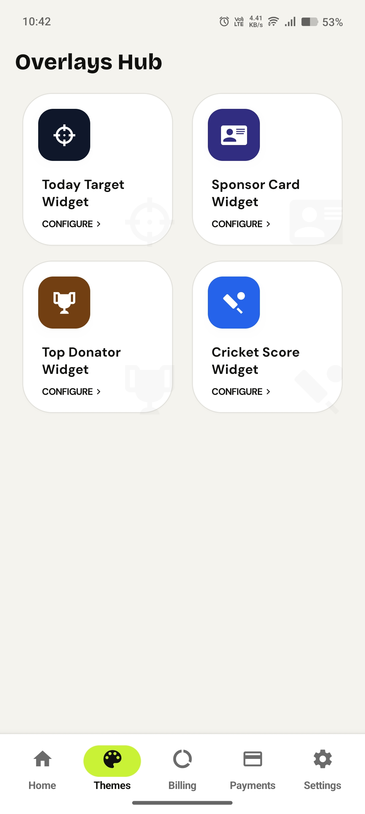
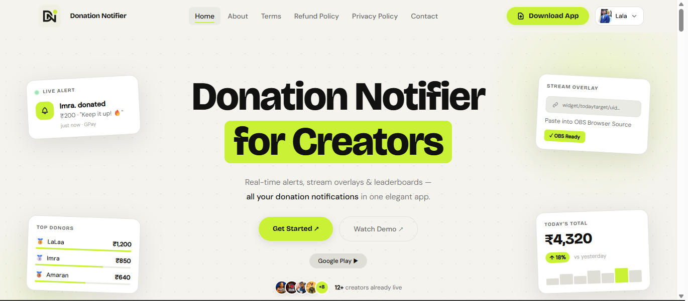
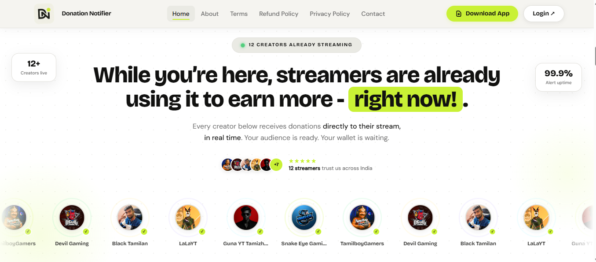

# Donation Notifier — Full-Stack Platform for Live Streamers

[](https://donationnotifier.vercel.app)
[](https://www.linkedin.com/in/imrannazeers/)
[](https://github.com/ImranNazeerS)

**React Native · React · Node.js · Socket.IO · Firebase · MongoDB · Razorpay**

> Real-time donation alerts, live OBS overlay widgets, and a full creator dashboard — built solo over 2 years as a passion project for Indian live streaming content creators.

---

> **⚠️ Portfolio Showcase — No Source Code**
>
> This repository contains only documentation and screenshots.
> Source code is private and available for review on request during interviews.

---

## What Is This?

Indian live streamers on YouTube, Twitch, and similar platforms receive donations via GPay, PhonePe, and Paytm — but had **no reliable way to get on-stream alerts** for those payments. I built this platform to solve that problem.

**Donation Notifier** is a 3-service platform:

- A **React Native Android app** the creator installs on their phone
- A **web platform** with a creator dashboard and OBS-ready overlay widgets
- A **dedicated real-time socket server** that broadcasts events in milliseconds

Everything works together: creator receives a donation → phone notifies instantly → on-stream overlay animates live.

---

## Platform in Action

### 📱 Mobile App — Android

| Home Screen | Dashboard | Overlays Hub |
|:-----------:|:---------:|:------------:|
|  |  |  |

### 🌐 Web Platform





---

## System Architecture

The platform runs as **3 independent services**:

```
┌─────────────────────────┐      ┌──────────────────────────────┐
│  📱 Mobile App           │      │  🌐 Web Platform (Vercel)     │
│  React Native 0.74       │      │  React 18 + Vite (frontend)  │
│  Firebase FCM + Notifee  │      │  Express.js (REST API)        │
│  Zustand state           │      │  MongoDB + Mongoose           │
│  Razorpay billing        │      │  11 OBS overlay widget routes │
│  RevoPush OTA updates    │      │  Razorpay subscriptions       │
└───────────┬─────────────┘      └──────────────┬───────────────┘
            │                                    │
            │          Socket.IO                 │
            └──────────────┬─────────────────────┘
                           │
               ┌───────────▼───────────┐
               │  ⚡ Socket Server      │
               │  Node.js + Socket.IO  │
               │  Firebase Auth        │
               │  Per-user rooms       │
               │  Billing metering     │
               │  Cricket score scraper│
               │  StreamElements bridge│
               └───────────────────────┘
```

**External services:**
Firebase (Auth · FCM · Firestore · Storage · App Check) · MongoDB Atlas · Razorpay · Cricbuzz (scraped) · StreamElements · Fly.io · Vercel · RevoPush

---

## Service Breakdown

### 📱 Service 1 — Mobile App (React Native)

The Android app that lives on the creator's phone. Connects to the socket server and receives real-time donation events — even when the screen is off.

**Core capabilities:**
- Rich push notifications via **FCM + Notifee** — custom sound, vibration, heads-up display
- Background notification listener — catches events even when the app is fully closed
- Overlay management panel — configure and preview all OBS widget types from the phone
- Live donation history with date-range filtering
- Custom alert sounds and multi-theme support
- Razorpay in-app subscription management
- **RevoPush OTA** — JavaScript bundle updates without Play Store re-submission

**Key technical decisions:**
- **Zustand over Redux** — minimal boilerplate for a large feature surface
- **Feature-based folder structure** (`src/features/`) — each feature owns its screens, hooks, and logic together
- **Firebase App Check** — prevents unauthorized clients from hitting the API
- **NativeWind** — Tailwind CSS utilities in React Native

**Stack:** `React Native 0.74` · `Firebase` · `Notifee` · `Socket.IO Client` · `Zustand` · `React Navigation v6` · `Razorpay` · `RevoPush` · `NativeWind` · `Lottie`

---

### 🌐 Service 2 — Web Platform (React + Express)

A full-stack web application with four layers in one deployment.

**Public website** — animated landing page with live community stats, feature showcase, APK download page, legal pages

**Creator dashboard** — Google OAuth sign-in, overlay manager, donation history, subscription billing, setup tracker

**OBS overlay widgets** — 11 widget types, each at its own URL route, paste directly into OBS Browser Source:

| Widget | Route |
|---|---|
| Today's Donations Total | `/widget/:uid` |
| Today's Target Progress | `/widget/todaytarget/:uid` |
| Top Donor List | `/widget/toplist/:uid` |
| Sponsor Card | `/widget/sponsorcard/:uid` |
| Sponsor Banner | `/widget/sponsorbanner/:uid` |
| Membership Count | `/widget/membershipcount/:uid` |
| Live Cricket Scoreboard | `/widget/scoreboard/:uid` |
| Animated Alert Popup | `/widget/alertwidget/:uid` |
| Top Donor Names | `/widget/topdonationlistname/:uid` |
| Challenge Text | `/widget/challenge/:uid` |
| Combined Multi-Info | `/widget/combined/:uid` |

**REST API** — Express.js: auth, user management, Razorpay payments + webhooks, Firebase, admin tools

**Key technical decisions:**
- **Vanilla CSS over CSS-in-JS** — overlay widgets run inside OBS browser sources; no runtime style injection
- **Monorepo layout** (`client/` + `server/`) — one `vercel.json` handles both static frontend and serverless API
- **HTTP-only cookies + JWT** — eliminates XSS token theft vs `localStorage`-based auth
- **Puppeteer with stealth plugin** — required for scraping; Cheerio alone was blocked

**Stack:** `React 18` · `Vite` · `React Router v6` · `Framer Motion` · `Express.js` · `MongoDB + Mongoose` · `Firebase Admin` · `Razorpay` · `Puppeteer` · `Cheerio` · `Helmet` · `Vercel`

---

### ⚡ Service 3 — Socket Server (Node.js + Socket.IO)

The real-time backbone. An always-on server handling everything that must happen in milliseconds.

**Core capabilities:**
- Receives donation events from the mobile app and pushes to OBS overlay widgets instantly
- Per-user socket rooms — Creator A's donations never reach Creator B's overlay
- Firebase Admin middleware validates every socket connection on connect
- Bridges StreamElements real-time alert events to the mobile app
- Scrapes live cricket scores from Cricbuzz and pushes to scoreboard widget via cron
- Per-session billing metering for subscription enforcement
- `/health` endpoint for uptime monitoring

**Key technical decisions:**
- **Dedicated server, not serverless** — WebSocket connections are long-lived; Vercel serverless terminates on cold start
- **Fly.io** — persistent process, no forced sleep; self-ping cron keeps free tier alive
- **In-memory connection Maps** — `connectedUsers` and `overlayConnections` shared in `state/connections.js`; no database round-trip per event

**Stack:** `Node.js 18+ (ESM)` · `Socket.IO v4` · `Express.js` · `Firebase Admin SDK` · `Cheerio` · `node-cron` · `CryptoJS` · `Fly.io`

---

## Key Challenges Solved

| Challenge | Solution |
|---|---|
| Alert on Android when screen is off | `react-native-android-notification-listener` intercepts FCM in a background service |
| OBS setup too complex for non-technical creators | One URL per widget, copy-paste into OBS Browser Source |
| Long-lived WebSocket can't run serverless | Dedicated Node.js server on Fly.io, separate from Vercel |
| Keeping free-tier socket server alive | Self-ping cron polls `/health` endpoint every few minutes |
| App updates without Play Store delays | RevoPush OTA delivers JS bundle changes post-installation |
| Unauthorized API access from sideloaded APK | Firebase App Check tokens required on every API request |
| Cricket score scraping blocked by bot detection | Puppeteer stealth plugin + Cheerio for parsing |

---

## Project Stats

| | |
|---|---|
| 🗓️ Development time | ~2 years (evenings & weekends) |
| 🧑‍💻 Team size | Solo |
| 📦 Services | 3 (Mobile · Web · Socket) |
| 📺 OBS overlay widget types | 11 |
| 🔥 Firebase services used | 6 (Auth · FCM · Firestore · Storage · App Check · Admin SDK) |
| 📱 Platforms | Android app · Web dashboard · Node.js API |
| 💳 Payment gateway | Razorpay |

---

## Live Platform

**🌐 [donationnotifier.vercel.app](https://donationnotifier.vercel.app)**

The platform is live with real users. The Android app is distributed as a signed APK via the `/download` page — no Play Store required.

---

## About Me

**Imran Nazeer S** — Full Stack & Mobile Developer, India

This project is the most honest representation of what I can build independently. Every architecture decision, library choice, and technical tradeoff above is something I researched, implemented, and debugged myself over 2 years.

I'm open to **full-time roles, freelance, and contract work** in React Native, full-stack JavaScript, and real-time systems.

**Source code is private but available for review on request during interviews.**

---

[](https://www.linkedin.com/in/imrannazeers/)
[](https://github.com/ImranNazeerS)
[](https://donationnotifier.vercel.app)

---

*© 2024–2026 Imran Nazeer S — All Rights Reserved*
